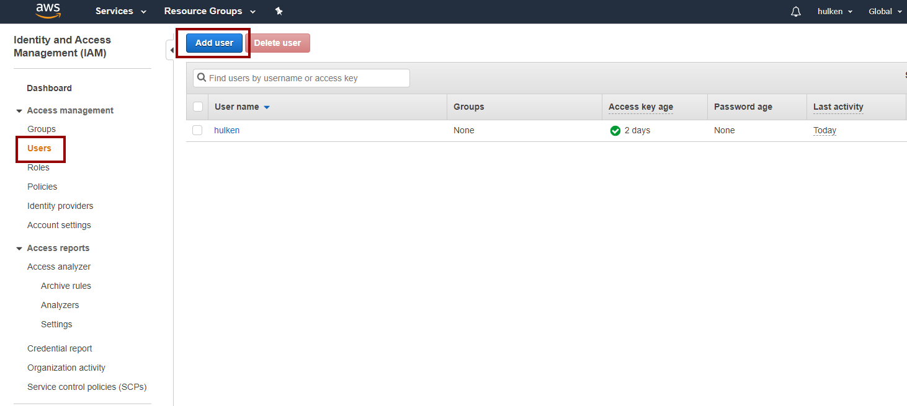
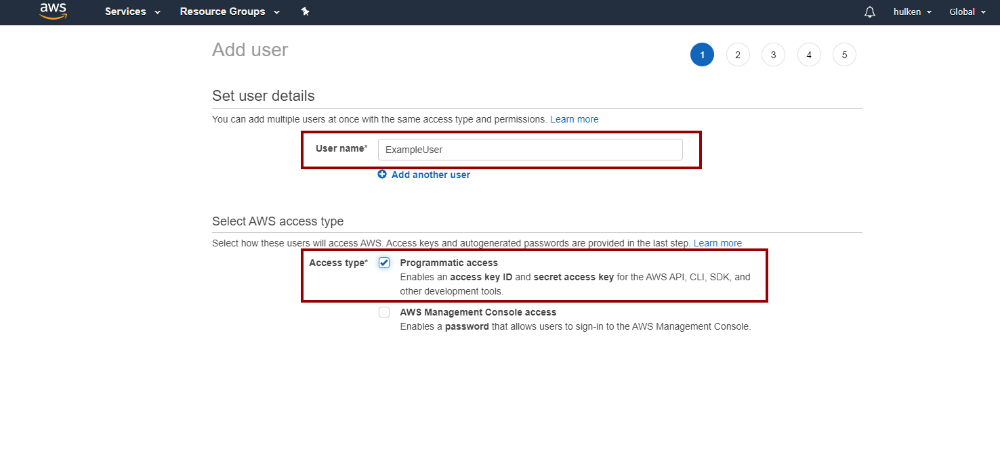
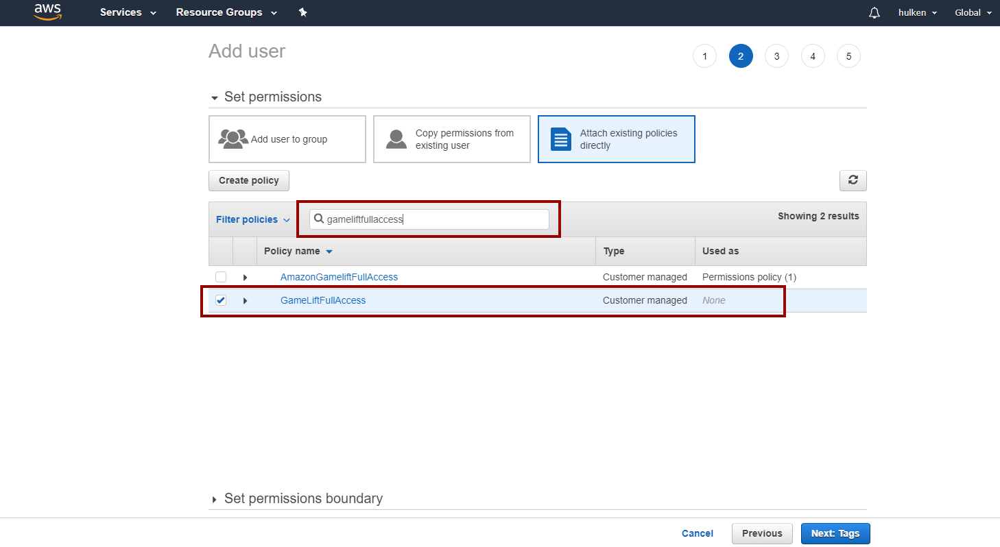
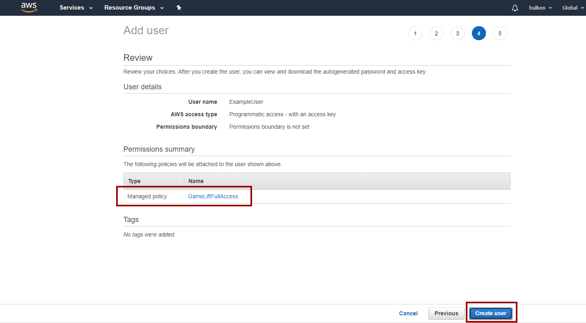
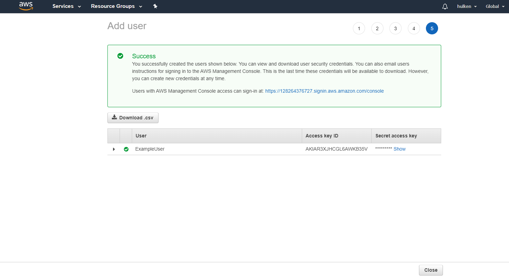
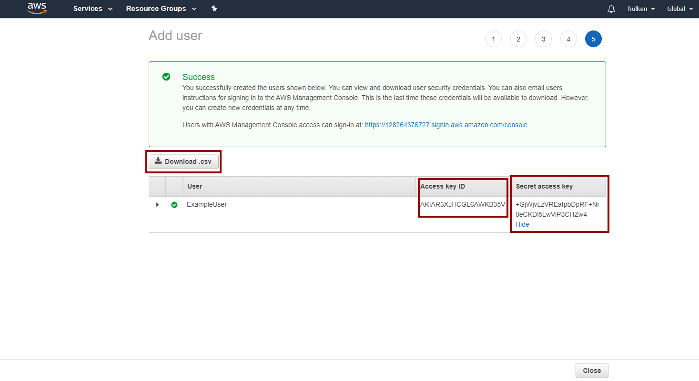

# Creating Access Policy User
- Before creating the Policy User for this example make sure you've created a [**Access Policy first**](./introduction.md)

:::warning
You can't proceed without creating a [**Access Policy first**](./introduction.md)
:::

## Add User
- Go to [https://console.aws.amazon.com/iam/home](https://console.aws.amazon.com/iam/home) and login to your AWS account
- Click on **Users** and then **Add user**

## User Details
- Select a username and select **Programmatic access**

## Attach Policy
- Attach the policy [**created in the previous step**](./introduction.md)

## Create User
- Click **Next** on Tags and skip this step. Move on to **Create User**

## Result

## Saving Credentials
- Download the .csv file and store it in a secure place, this file contains the credentails for this user

