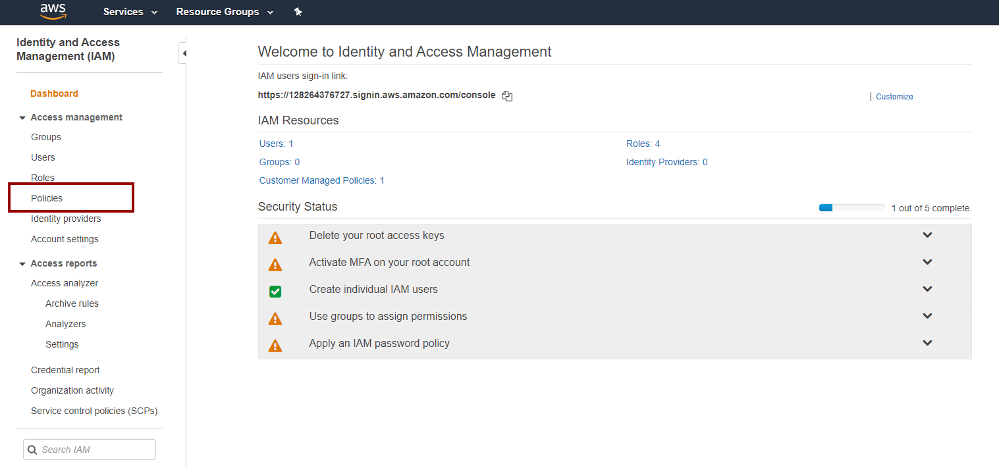
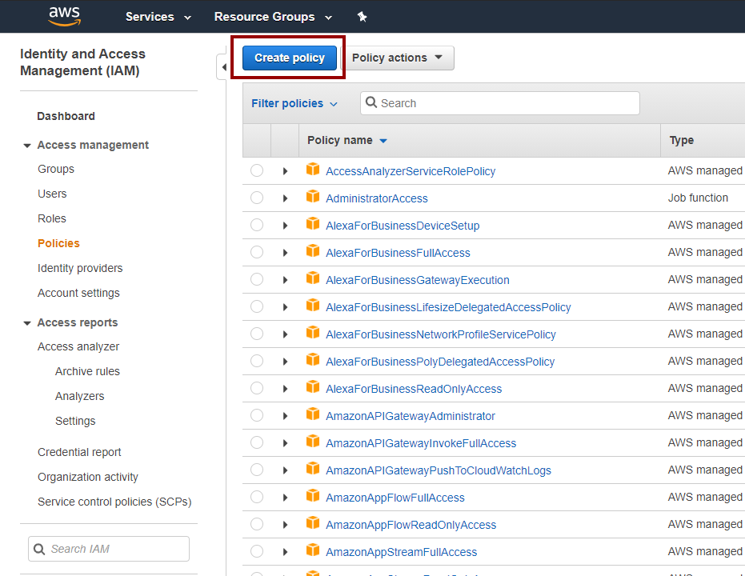
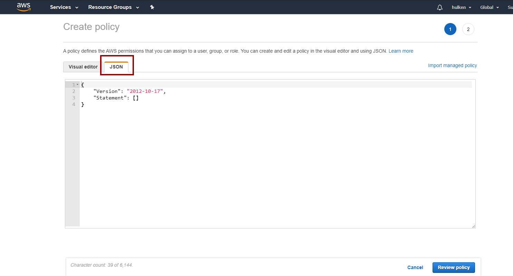
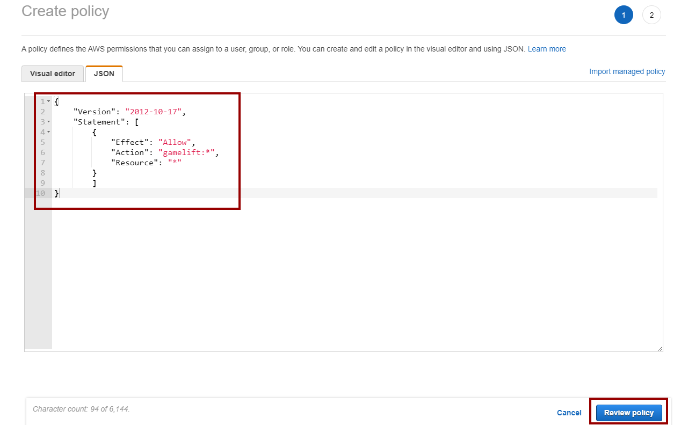
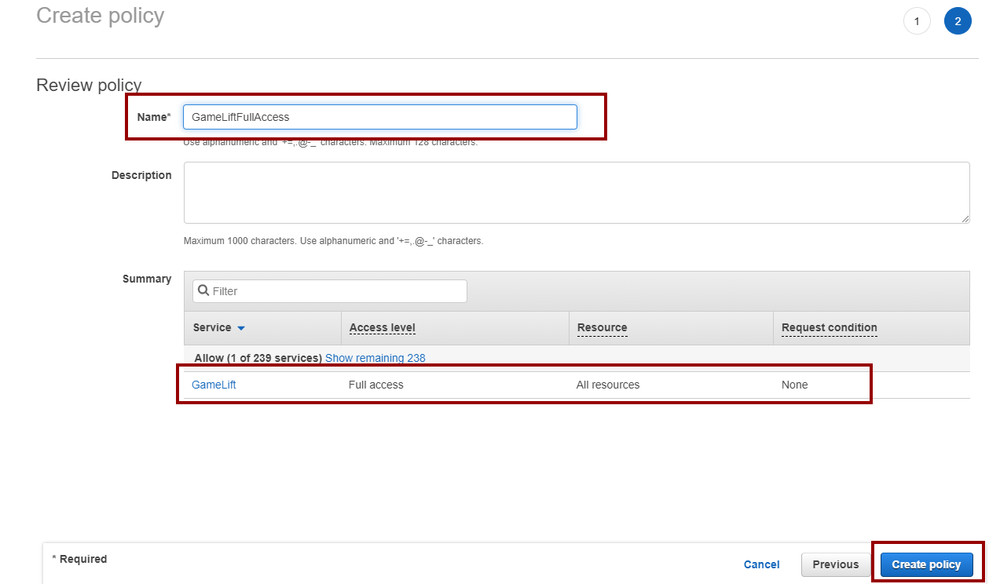
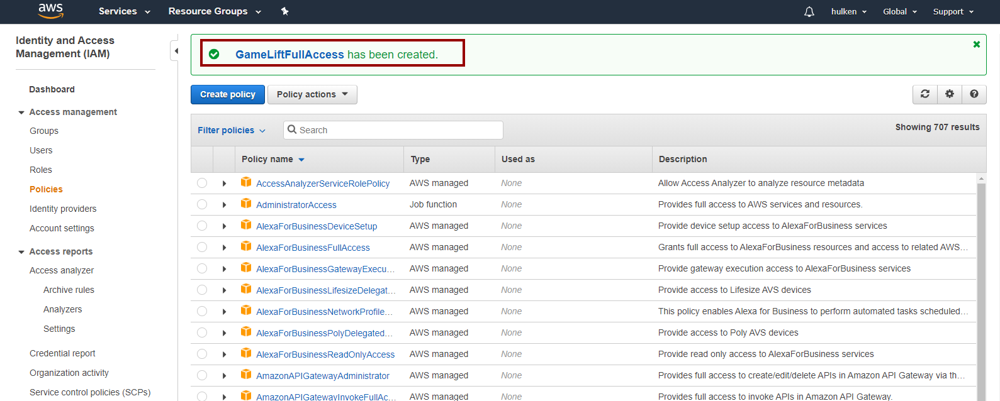

# Creating Access Policy

:::danger WARNING
**THIS ACCESS POLICY WILL GRANT THE USER PERMISSION TO EVERYTHING RELATED TO GAMELIFT AND THIS SHOULD NOT BE USED IN A LIVE PROJECT. USE THIS ONLY FOR TESTING PURPOSES AND DO NOT SHIP YOUR GAME WITH THIS POLICY SETUP.**

IT'S RECOMMENDED TO USE A PLUGIN SUCH AS [**STS**](https://sts.eeldev.com/) WHICH CAN GRANT YOUR USER TEMPORARY PERMISSIONS DEPENDING ON WHAT YOUR PROJECT NEEDS AND THIS WAY YOU WILL NOT HAVE TO SHIP YOUR GAME WITH HARD CODED PERMISSIONS.

**eelDev DOES NOT TAKE RESPONSITILIBTY IF YOU SHIP YOUR GAME WITH FULL ACCESS CREDENTIALS.**
:::


## Getting Started
- Go to [https://console.aws.amazon.com/iam/home](https://console.aws.amazon.com/iam/home) and login to your AWS account
- Click on the **Policies** button when you are logged into IAM



## Create Policy


## Select “JSON” Type


:::tip
 COPY-PASTE THIS CODEBLOCK INTO THE TEXT EDITOR
:::
``` 
{
    "Version": "2012-10-17",
    "Statement": [
        {
            "Effect": "Allow",
            "Action": "gamelift:*",
            "Resource": "*"
        }
        ]
}
``` 

## The Result
- The result will look something like this, click on **Review policy** when done.



## Policy Name
- Give the Policy a name and click on **Create policy** when done.



## Verify
- Verify that the policy has been created


