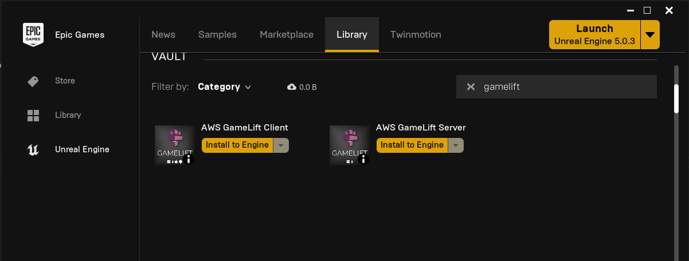
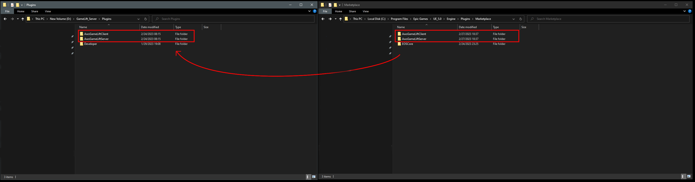
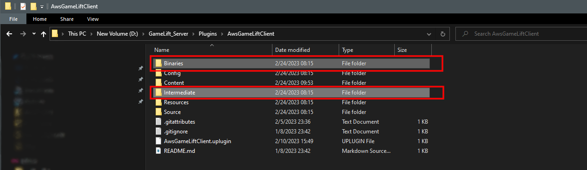

# Installing the Plugin 
- You install the plugin(s) using the Epic Launcher



## Locate the plugin install location
- In this example it's located here:
```
C:\Program Files\Epic Games\UE_5.0\Engine\Plugins\Marketplace
```

:::warning
**Move the plugin** (do **not** *copy*) to your projects Plugins folder, if the Plugins folder does not exist in your project then create it.
:::




## Clean the Plugin(s)
- **Delete** the Intermediate and Binaries folders inside the plugin folders.



