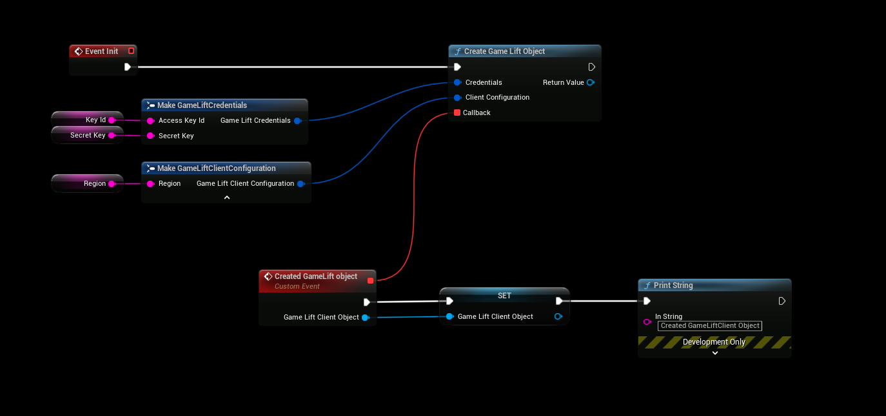
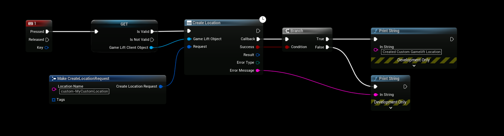
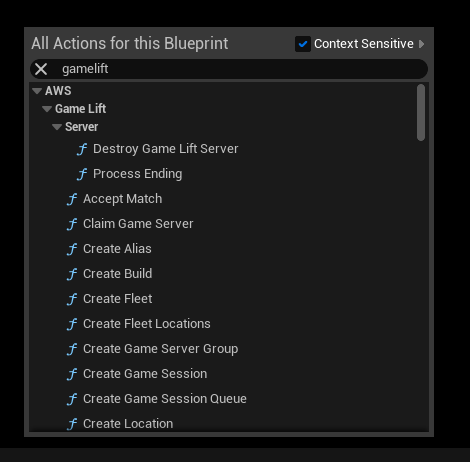
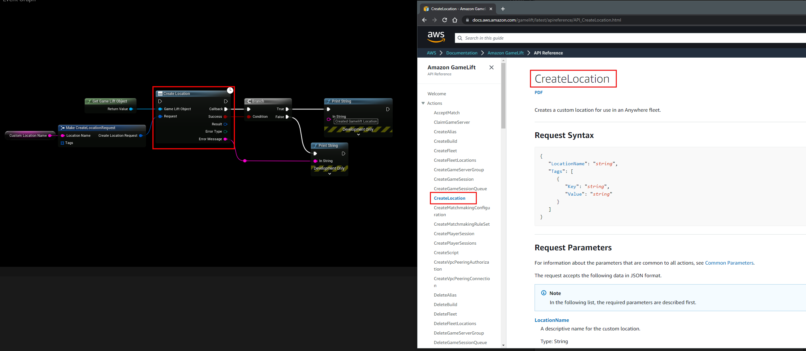

# Using the Plugin

# Access Policy 
- [Before using gamelift you have to **create a access policy and a user attached to the policy**](./access_policy/introduction.md)

:::warning
You have to create and use a Access Policy before using this plugin, see the note above.
:::

## Initializing
- Initialize the GameLift Client using the credentials that were provided in the [previous step](./access_policy/introduction.md)
- Also make sure to select the appropriate region that you're going to be hosting on, for example *eu-west-2*.
- After the callback is triggered you can start using gamelift functionality, calling gamelift functionality before the callback has returned will **cause a hard crash**.

## Example 
- Simple example that creates a custom gamelift location

## Blueprint Functions
- To find a list of all the available Blueprint functions, type in "gamelift" in the blueprint context menu

# Using the Documentation
- [**Gamelift API Documentation**](https://docs.aws.amazon.com/gamelift/latest/apireference/API_Operations.html)
- All blueprint functions are named the same as in the official gamelift documentation, see the example below:

- [**Gamelift API Documentation**](https://docs.aws.amazon.com/gamelift/latest/apireference/API_Operations.html)

# Additional Documentation
- [Gamelift Developer Guide](https://docs.aws.amazon.com/gamelift/latest/developerguide/gamelift-dg.pdf)