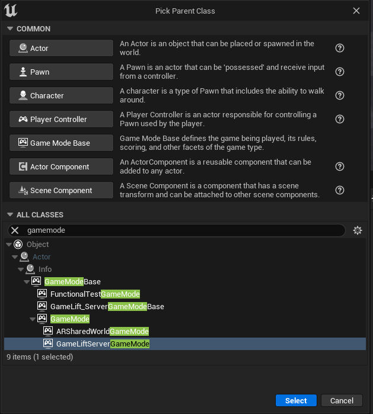
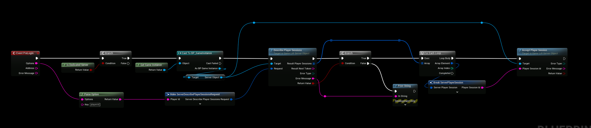
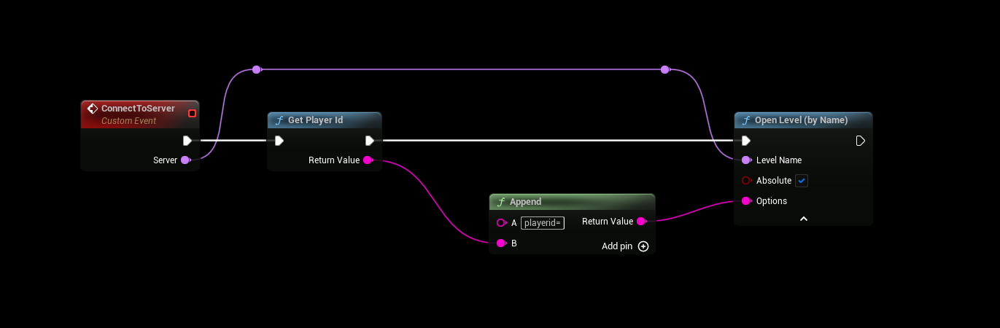

# GameLift Game Mode
:::tip
This information is completely **optional** and is not required to use the plugin
:::

## Creating the game mode
- The GameLift**Server** plugin comes with a GameMode that you can use to make it easier to Accept player sessions, it has a overridable blueprint event called **PreLogin** that you can use to grab PlayerIds from.
- Reparent or create a new game mode based on the Gamelift GameMode

## Using the game mode
- You can use this event to accept incoming player sessions

## Including PlayerId
- You can send your PlayerId to the server by appending it to your Options string, this will make it available to the server when connecting and using it in the example above.

