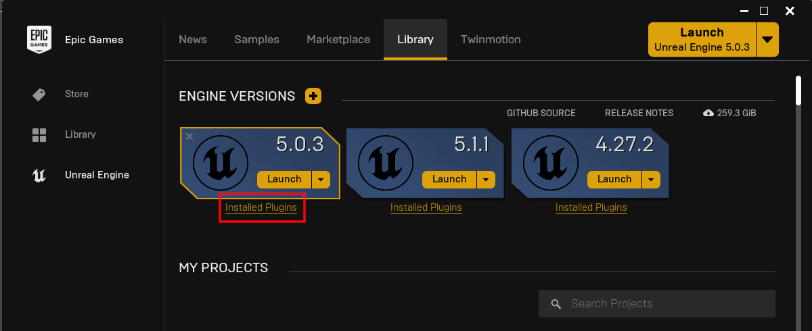
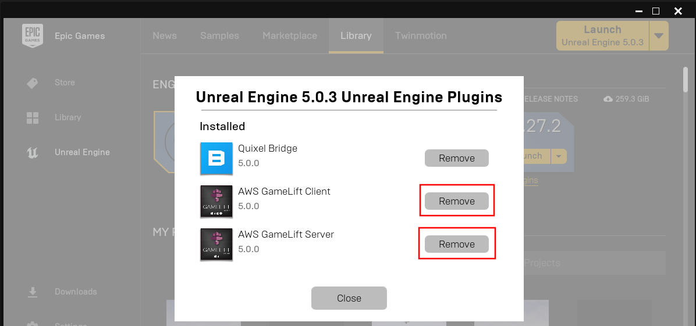
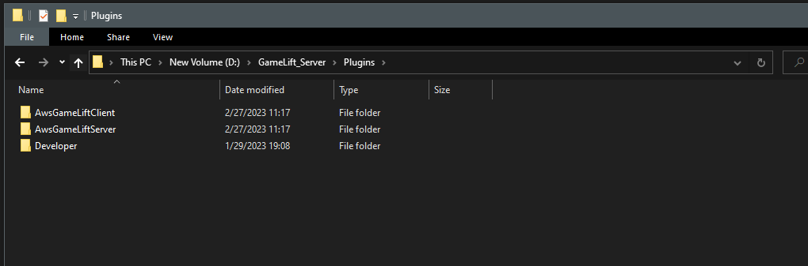

# Updating the Plugin
- The Epic Launcher sometimes does not update plugins properly and in most cases it's best to do a clean install of the plugin instead of updating it

## Remove old plugin
- Click on Installed Plugins for your Engine version

## Deleting the plugin
- Delete the plugin from your projects **Plugins** folder

# Updating the Plugin
- After following the steps above use the Epic Launcher to Install the plugin again, you can follow the [**install instructions here**](./installing_plugin.md)