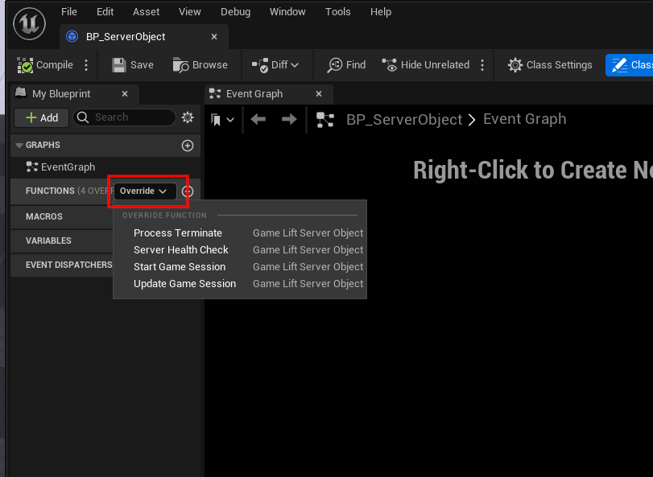

# Using the Plugin

## Requirements
- A working Unreal Engine Dedicated Server. *See the **Unreal Engine Documentation** on how to set this up*
- A game configured for Dedicated Server use.

## Gamelift Server Object
- First create a Server Object, this object can be used to customize how your game instance handles and reports back to gamelift services.

## Overridable functions
- There are several functions that you can override and customize inside the server object. (Not needed for this sample setup).

## Initializing Server (Hosting on GameLift)
- The example below is going to create a Server Object and then call Init Sdk on the Constructed Server Object, the InitSdk function is going to communicate with Amazon Gamelift and initialize the server on the AWS backend.
- [**Init Sdk Documentation**](https://docs.aws.amazon.com/gamelift/latest/developerguide/integration-server-sdk5-cpp-actions.html#integration-server-sdk5-cpp-initsdk)

## Initializing Server (Gamelift Anywhere)
- Initializing a Gamelift Anywhere instance is going to require some additional steps such as getting compute and auth tokens from Gamelift using the Gamelift **Client** plugin as the Server plugin can't get the required information on it's own.
- [**Init Sdk Documentation**](https://docs.aws.amazon.com/gamelift/latest/developerguide/integration-server-sdk5-cpp-actions.html#integration-server-sdk5-cpp-initsdk)

:::warning IMPORTANT NOTE
Note that the examples below are simple examples and should not be used in a live project, they are only examples to give you an idea on how to initialize a gamelift anywhere fleet. You will have to customize the settings and parameters to fit your own project and needs.
:::

 

