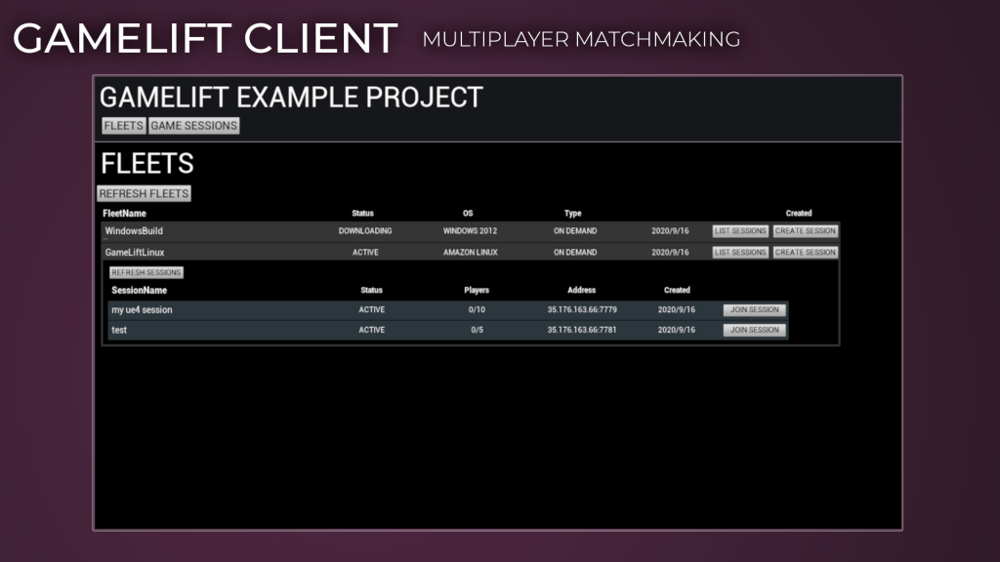

# Introduction

## eelDev GameLift Plugins
There are **2** plugins available in the GameLift family. GameLift**Client** and GameLift**Server**

- GameLift**Server** is what is used on a dedicated server only. This plugin is what “controls” what the server instance does, when it should start or terminate, for example.
- GameLift**Client** is the plugin that Clients/Players use to communicate with Amazon GameLift, handling matchmaking, creating and finding sessions and much more.

## GameLift
Amazon GameLift is a dedicated game server hosting solution that deploys, operates, and scales cloud servers for multiplayer games. Whether you’re looking for a fully managed solution, or just the feature you need, GameLift leverages the power of AWS to deliver the best latency possible, low player wait times, and maximum cost savings.

